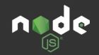
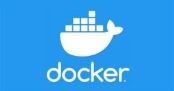

## *Data Engineering Project* ##
------------------------------

   |   

### *Dependencies* ###
------------------

> 1. `Parcel` is a build tool && `cubejs` is for fetching / connecting to the datasource for visualisation.
> 2. `Chartjs` is for presenting the data in graphs

 ### *Type Cube Properties* ###
 ----------------------------
 | Property |  Datatype |
 | :--------: |  :--------: |
 | name:    | `string`  |
 | title:   | `string`  |
 | description?: | `string` | `undefined` |
 | measures: | `TCubeMeasure[]` |
 | dimensions: | `TCubeDimension[]` | 
 | segments: | `TCubeSegment[]` |  
 | connectedComponent?: | `number`,`undefined` |
 | type?: | `view`,`cube`,`undefined` |  
 | isVisible?: | `boolean`,`undefined` |
 |  public?: | `boolean`,`undefined` |

 
 ### *To Run The Application, Please Follow The Order of Sequence* ###
 ----------------------------------
- [x] Ensure you have `nodejs`  &&  `docker` installed on your system. 
- [x] To download `nodejs`  &&  `docker` follow the links below: 

- [x]   

- [x] 

- [x] Clone this repository by typing `git clone <repository-name>` replacing the `<repository-name>` with `<this-repository-name>`on your command line interface.
- [x] Run `npm run build` to install the dependencies and build the application.
- [x] Start `docker engine / application` on your system / computer to enable the `postgres database` in the application function properly.
- [x] Type `npm run production` on your command line interface to start the `postgres Database Docker` instance and launch the application.
- [x] Navigate to your browser and enter `localhost:1234/localquery` to navigate to the postgres DB query analysis page

### Note ###
------------
+ By default the application launches `localhost:1234/cloudquery` 
+  There are currently two resources in the application :
>> `/localquery` 
>> `/cloudquery`
